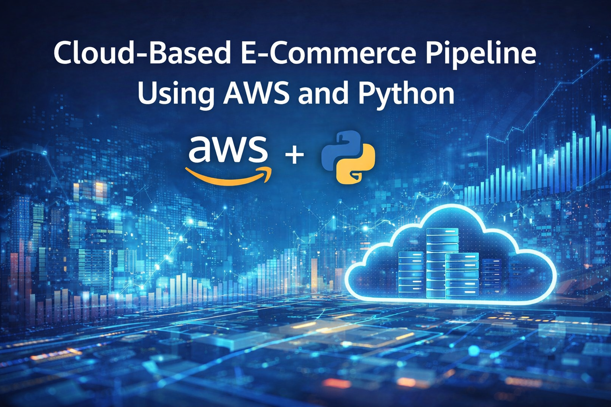
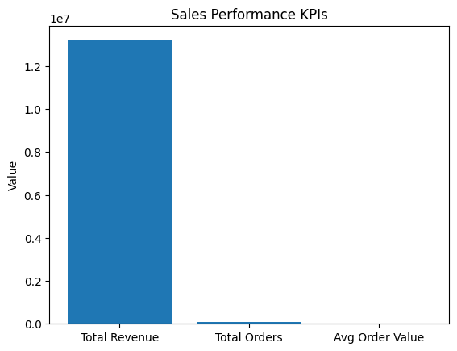
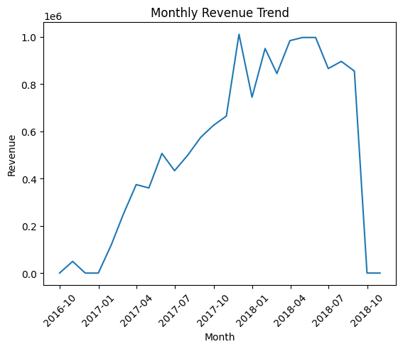
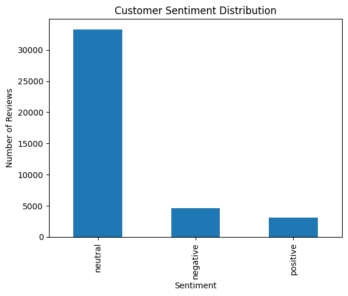
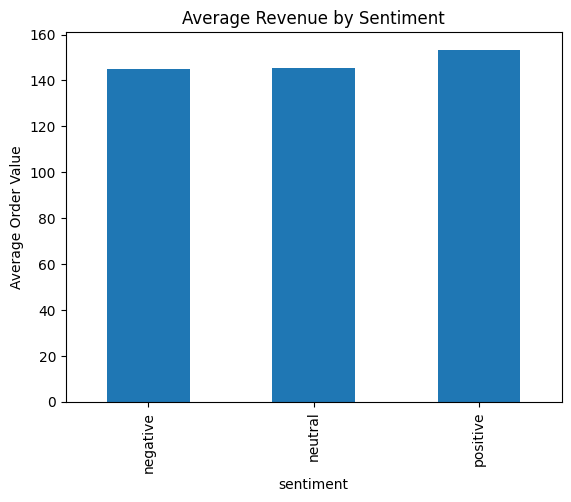
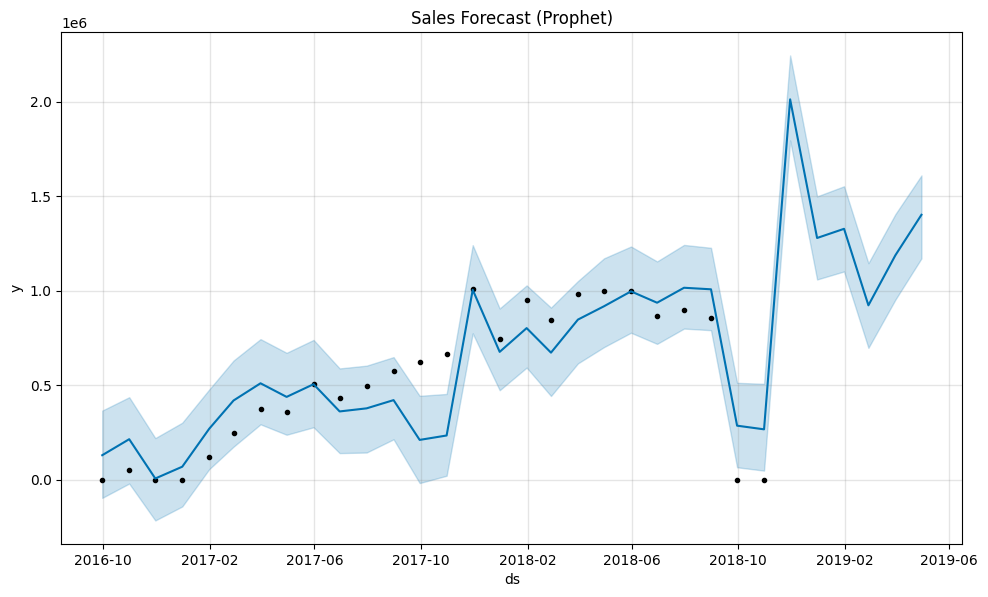
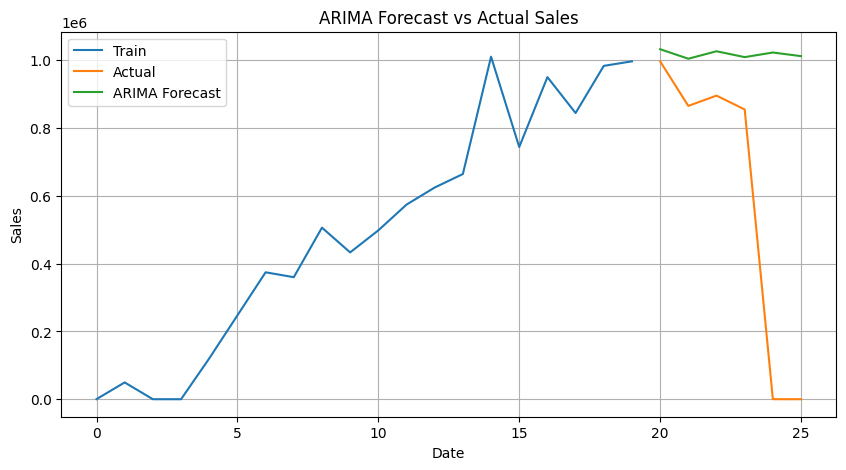
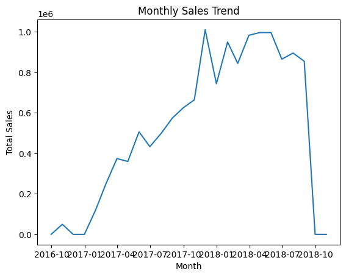
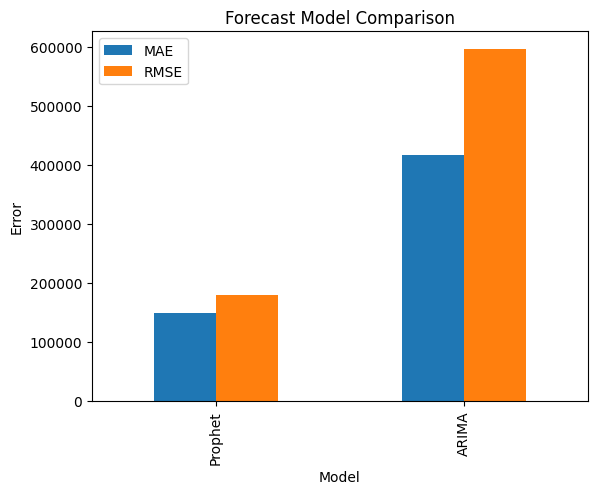

# ☁️ Cloud-Based E-Commerce Analytics Pipeline (AWS)



## 📝 Problem Statement

Modern e-commerce businesses generate massive volumes of transactional and customer feedback data. Without a scalable pipeline, it's difficult to extract timely insights on sales performance, customer sentiment, and future demand.

This project builds an end-to-end **cloud-based data pipeline** on **AWS S3**, using the Brazilian **Olist e-commerce dataset**, to ingest raw data, transform it into a structured data model, and generate analytics covering sales KPIs, customer sentiment, and sales forecasting.

## 🎯 Objectives

- Build a data lake on AWS S3 with raw, processed, and analytics zones.
- Design a star-schema data model (fact and dimension tables) via a Python-based ETL layer.
- Perform descriptive analytics on sales performance (revenue, orders, average order value).
- Run NLP-based sentiment analysis on customer reviews.
- Forecast future sales using Prophet and ARIMA, and compare model accuracy.
- Visualize results across three dashboards: Sales Performance, Customer Sentiment, and Sales Forecasting.

## ⚙️ Architecture & Pipeline

1. **AWS IAM & S3 Setup** — Configure AWS credentials and connect to an S3 bucket via `boto3`.
2. **Data Ingestion** — Load the Olist dataset (customers, orders, order items, payments, reviews, products, sellers, geolocation) from CSV.
3. **Data Lake — Raw Zone** — Upload raw tables to `s3://<bucket>/data-lake/raw/`.
4. **ETL & Data Modeling** — Clean, aggregate, and join tables into a star schema:
   - `fact_orders` — order-level facts (items, freight, price, payments)
   - `dim_customers`, `dim_products`, `dim_time` — dimension tables
5. **Data Lake — Processed Zone** — Load curated Parquet tables to `s3://<bucket>/data-lake/processed/`.
6. **Analytics & Machine Learning**
   - **Descriptive analytics** — total revenue, total orders, average order value, monthly sales trend.
   - **Sentiment analysis** — VADER (NLTK) sentiment scoring on customer review text; sentiment-vs-revenue correlation.
   - **Sales forecasting** — Prophet and ARIMA models, evaluated via MAE and RMSE.
7. **Data Lake — Analytics Zone** — Store analytics outputs (monthly sales, sentiment-scored reviews) back to S3.
8. **Visualization & Dashboards**
   - **Dashboard 1 — Sales Performance:** KPIs, monthly revenue trend.
   - **Dashboard 2 — Customer Sentiment:** sentiment distribution, sentiment-vs-revenue impact.
   - **Dashboard 3 — Sales Forecasting:** Prophet forecast, Prophet vs ARIMA comparison.

## 📊 Results

### Sales Performance Dashboard

| Sales KPIs | Monthly Revenue Trend |
|---|---|
|  |  |

### Customer Sentiment Dashboard

| Sentiment Distribution | Avg Revenue by Sentiment |
|---|---|
|  |  |

### Sales Forecasting Dashboard

| Prophet Forecast | ARIMA Forecast |
|---|---|
|  |  |

| Monthly Sales Trend | Forecast Model Comparison (MAE / RMSE) |
|---|---|
|  |  |

## 🛠️ Tools & Libraries

- **Cloud:** AWS S3, boto3 (IAM-based access)
- **Data handling:** pandas, numpy, pyarrow, fastparquet
- **Visualization:** matplotlib, seaborn
- **NLP:** NLTK (VADER Sentiment Intensity Analyzer)
- **Forecasting:** Prophet, statsmodels (ARIMA)
- **Evaluation:** scikit-learn (MAE, RMSE)

## 📁 Repository Structure

```
cloud-based-ecommerce-pipeline-aws/
├── cloud_based_ecommerce_pipeline_aws.ipynb   # Main pipeline notebook
├── data/                                       # Olist dataset (see Dataset section below)
├── images/
│   ├── title_image.png
│   ├── sales_performance_kpis.png
│   ├── monthly_revenue_trend.png
│   ├── customer_sentiment_distribution.png
│   ├── avg_revenue_by_sentiment.png
│   ├── prophet_forecast_dashboard.png
│   ├── arima_forecast.png
│   ├── monthly_sales_trend.png
│   └── forecast_model_comparison.png
├── README.md
├── LICENSE
└── .gitignore
```

## 🚀 Running the Notebook

This notebook was built in Google Colab and connects to AWS S3.

1. Open the notebook in [Google Colab](https://colab.research.google.com/).
2. Have the [Brazilian Olist e-commerce dataset](https://www.kaggle.com/datasets/olistbr/brazilian-ecommerce) ready as a ZIP file (`Brazilian Olist.zip`) — upload when prompted.
3. Create an S3 bucket in your own AWS account and update the `S3_BUCKET` variable to match.
4. Run all cells — you'll be prompted to securely enter your **AWS Access Key ID** and **Secret Access Key** via `getpass` (never hardcoded in the notebook).
5. The notebook will populate raw, processed, and analytics zones in your S3 bucket, then generate all dashboards inline.

> ⚠️ **Security note:** This notebook never stores AWS credentials in code — they're entered at runtime via `getpass`. Do not hardcode your keys anywhere in the notebook before committing.

## 📦 Dataset

This project uses the **Brazilian E-Commerce Public Dataset by Olist**, available on [Kaggle](https://www.kaggle.com/datasets/olistbr/brazilian-ecommerce). Due to its size, the raw dataset is not included in this repository — download it from Kaggle and place it as described in the notebook's ingestion step.

## 📄 License

This project is licensed under the [MIT License](LICENSE).

## ✅ Conclusion

This project demonstrates a full cloud-based analytics pipeline — from raw data ingestion through a structured data lake on AWS S3, to descriptive analytics, NLP-driven sentiment analysis, and time-series forecasting. Comparing Prophet and ARIMA highlights the trade-offs between the two forecasting approaches for e-commerce sales prediction.
